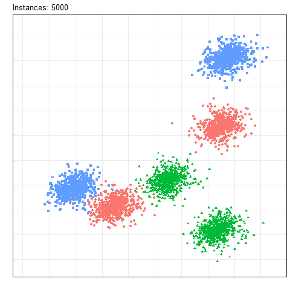
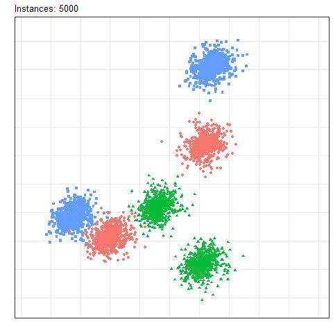
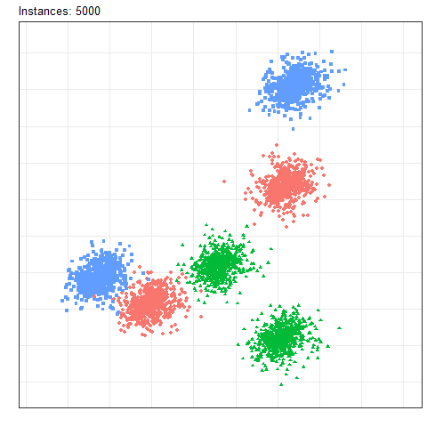
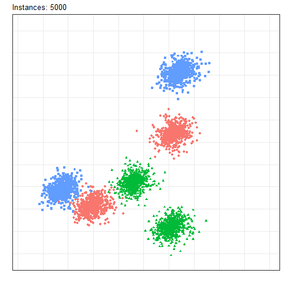

# A comprehensive analysis of concept drift locality in data streams

This repository provides the source code, drift detectors, classifiers, experimental setup, and results for the experimental study on locality of concept drifts. The manuscript is available at [Knowledge-based Systems](https://www.sciencedirect.com/science/article/abs/pii/S0950705124001709?casa_token=2MNh6hqhCCYAAAAA:nn79iAoF_wO6MmH9u_qPd-CulsZUuCpP9ABdQQ-aE0c7TRFwiH394umyzmJq8lCMJYJlTFMxwWbb).

This [website](https://gabrieljaguiar.github.io/comprehensive-concept-drift/) provides interactive plots to display the metrics over time and result files for each experiment, algorithm, and benchmark.

The experiments were run using Python 3.11 and all required packages are available in the file ``requirements.txt``

## Abstract

Adapting to drifting data streams is a significant challenge in online learning. Concept drift must be detected for effective model adaptation to evolving data properties. Concept drift can impact the data distribution entirely or partially, which makes it difficult for drift detectors to accurately identify the concept drift. Despite the numerous concept drift detectors in the literature, standardized procedures and benchmarks for comprehensive evaluation considering the locality of the drift are lacking. We present a novel categorization of concept drift based on its locality and scale. A systematic approach leads to a set of 2,760 benchmark problems, reflecting various difficulty levels following our proposed categorization. We conduct a comparative assessment of 8 state-of-the-art drift detectors across diverse difficulties, highlighting their strengths and weaknesses for future research. We examine how drift locality influences the classifier performance and propose strategies for different drift categories to minimize the recovery time. Lastly, we provide lessons learned and recommendations for future concept drift research.

## Algorithms
The package  `drift_detectors` contains 7 state-of-the-art drift detectors algorithms plus 2 from the `river` package. Some of the drift detectors were wrapped into a new class in order to fit better the experiment script.

|Algorithm|Script|
|--|--|
|ADWIN| `drift_detectors.ADWINDW`|
|PageHinkley| `drift_detectors.PHDW`|
|HDDM| `drift.binary.HDDM_W()`|
|KSWIN| `drift_detectors.KSWINDW`|
|DDM| `drift.binary.DDM()`|
|RDDM| `drift_detectors.RDDM_M`|
|STEPD| `drift_detectors.STEPD_M`|
|ECDD| `drift_detectors.ECDDWT_M`|
|EDDM| `drift_detectors.EDDM_M`|


## Benchmark streams

### Single-Class drift

<!-- ADD here how to use Single-Class part -->
Single-Class drifts are generated using the file ``generators/single_class.py``

The following code serves as an illustrative example of generating streams featuring single-class drifts. It facilitates the generation of streams with Local Drifts exhibiting 3, 5, and 10 classes, encompassing 2 and 5 features. Additionally, it includes only Sudden Drifts, denoted by a ``drift_width`` value of 1.

```python 
from generators.single_class import generate_streams

streams = generate_streams(
    n_classes = [3, 5, 10],
    n_features = [2, 5],
    drift_width = [1],
    locality = ["local"],
):

```


<table>
  <tr>
    <td>Local</td>
    <td>Global</td>
  </tr>
  <tr>
    <td valign="top"></td>
    <td valign="top"></td>
  </tr>
 </table>


### Multi-Class drifts

Multi-Class drifts are generated using the file ``generators/multi_class.py``

The following code serves as an illustrative example of generating streams featuring multi-class drifts. It facilitates the generation of streams with Local Drifts exhibiting 3, 5, and 10 classes, encompassing 2 and 5 features. Additionally, this code allows the specification of the number of affected classes in each scenario. For instance, with 3 classes, only 1 will be affected, while for 5 classes, there will be streams with 2 and 3 affected classes, and so on. 

```python 
from generators.single_class import generate_streams

streams = generate_streams(
    n_classes = [3, 5, 10],
    n_features = [2, 5],
    classes_affected = [[1], [2, 3], [3, 5]]
    drift_width = [1],
    locality = ["local"],
):

```


<table>
  <tr>
    <td>Local</td>
    <td>Global</td>
  </tr>
  <tr>
    <td valign="top"></td>
    <td valign="top"></td>
  </tr>
 </table>

## Results

This [website](https://gabrieljaguiar.github.io/comprehensive-concept-drift/) provides interactive plots to display the metrics over time and result tables for each experiment, algorithm, and benchmark.

Complete csv results for all experiments, algorithms, and benchmarks reported on the manuscript are available to [download](https://drive.google.com/drive/u/1/folders/1D0xy9u9bDgvGZTt_ZoioChVStM0JCtG7) to facilitate the transparency, reproducibility, and extendability of the experimental study.

## Citation
```
@article{aguiar2024comprehensive,
  title={A comprehensive analysis of concept drift locality in data streams},
  author={Aguiar, Gabriel J and Cano, Alberto},
  journal={Knowledge-Based Systems},
  pages={111535},
  year={2024},
  publisher={Elsevier}
}
```
